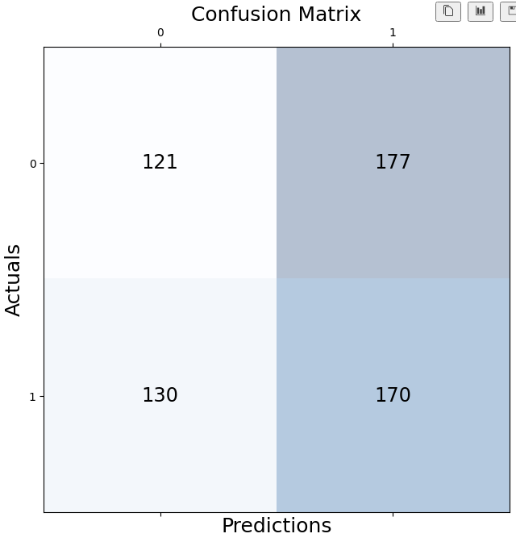
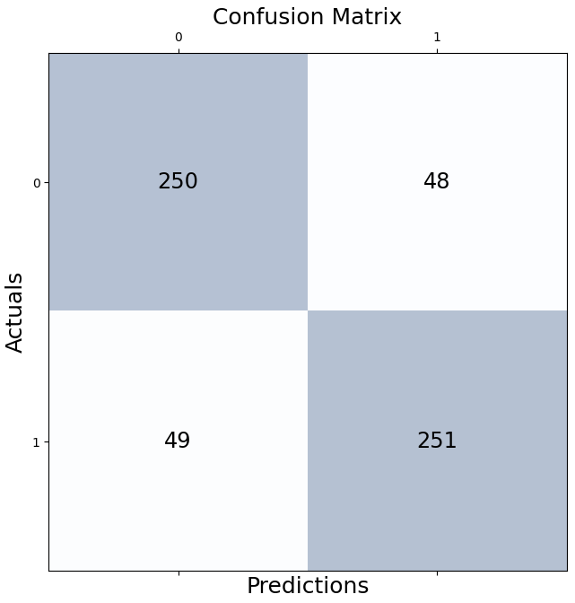
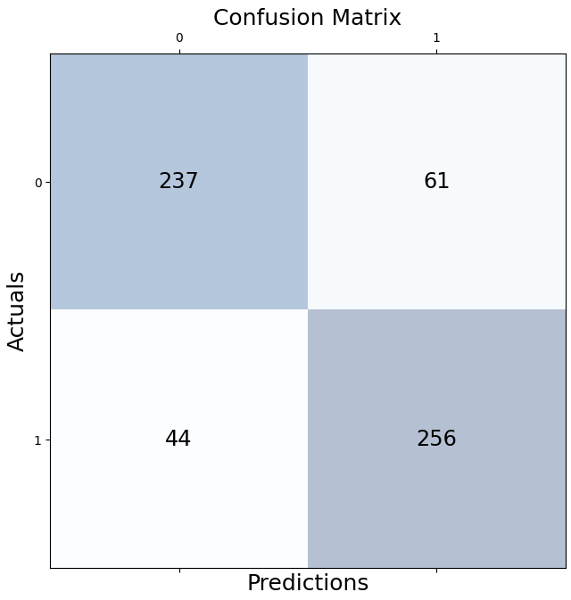
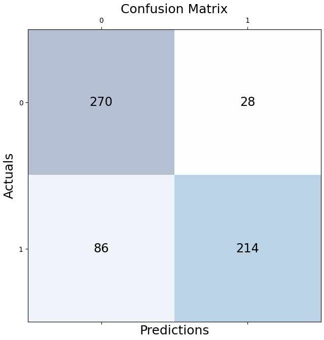
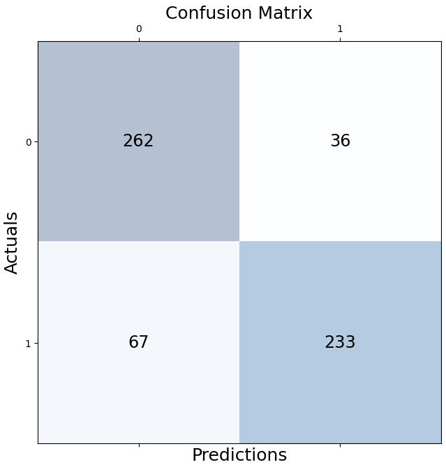
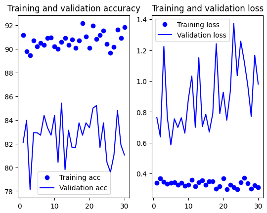
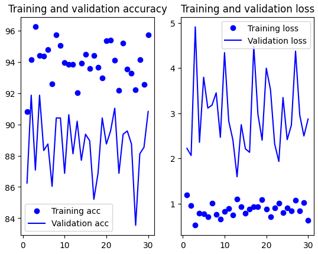
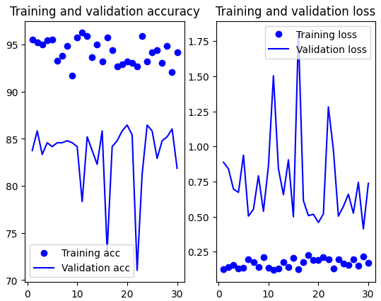

# Brazilian coffee fields

## Small convnet

Accuracy: 83.11 %
val_loss: 0.7016 - val_accuracy: 0.8177

## Adding data augmentation

Accuracy: 80.27 %

## Feature extraction

val_loss: 1.7973 - val_accuracy: 0.8244

### With Dropout 0.5

val_loss: 1.2140 - val_accuracy: 0.8094

### With Dropout 0.1

val_loss: 0.9374 - val_accuracy: 0.8278

___
## VGG16
- Overall training accuracy: 90.68
- Overall training loss: 0.33
- Overall validation ACCURACY: 82.58
  - Mean:  82.58
  - Standard deviation:  1.77
  - Variance:  3.13
- Overall validation LOSS: 0.90
  - Mean:  0.90
  - Standard deviation:  0.21
  - Variance:  0.04

## ResNet50
- Overall training accuracy: 93.96   
- Overall training loss: 0.87   
- Overall validation ACCURACY: 88.68
  - Mean:  88.68
  - Standard deviation:  1.95
  - Variance:  3.79
- Overall validation LOSS: 2.96
  - Mean:  2.96
  - Standard deviation:  0.82
  - Variance:  0.68

## EfficientNetB0
- Overall training accuracy: 94.24
- Overall training loss: 0.17
- Overall validation ACCURACY: 83.50
  - Mean:  83.50
  - Standard deviation:  3.49
  - Variance:  12.18
- Overall validation LOSS: 0.75
  - Mean:  0.75
  - Standard deviation:  0.31
  - Variance:  0.10

