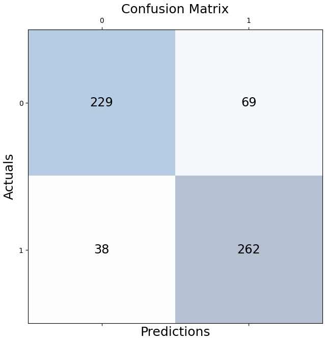

# Brazilian coffee fields

## Small convnet

Accuracy: 83.11 %
val_loss: 0.7016 - val_accuracy: 0.8177

## Adding data augmentation

Accuracy: 80.27 %

## Feature extraction

val_loss: 1.7973 - val_accuracy: 0.8244

### With Dropout 0.5

val_loss: 1.2140 - val_accuracy: 0.8094

### With Dropout 0.1

val_loss: 0.9374 - val_accuracy: 0.8278

